# OpsFlo Website Sitemap — Master Architecture
### Synthesized from Strategic Positioning Documents + Competitor Research

---

## 1. STRATEGIC SYNTHESIS (Why This Sitemap Exists)

The four strategy documents each propose a different positioning lens for OpsFlo. Rather than choosing one, this sitemap treats them as **complementary layers** that serve different buyer personas at different stages of the funnel:

| Document | Positioning Angle | Primary Buyer | Funnel Stage |
|----------|------------------|---------------|--------------|
| Doc 1 | AI-Powered Operations OS (prevent downtime) | Operations Manager, CTO | Awareness / Consideration |
| Doc 2 | Operations Execution System (ensure completion) | Operations Manager, VP Ops | Consideration |
| Doc 3 | Revenue Capture & Billing Acceleration (protect revenue) | CFO, Finance Director | Decision / Justification |
| Doc 4 | Maintenance & Inspection Execution Platform (ensure action) | Field Supervisor, HSE Manager | Evaluation / Pilot |

### Unified Positioning (for website)

> **OpsFlo is the execution layer for oilfield operations** — ensuring every inspection, maintenance task, and field job is completed, validated, and converted to revenue. With AI that predicts failures before they happen.

### Three narrative threads woven throughout the site:

1. **Execution Guarantee** — "We don't just track work. We ensure it gets done." (Docs 2 & 4)
2. **Revenue Protection** — "Close the gap between job completion and billing." (Doc 3)
3. **Predictive Intelligence** — "Prevent failures. Don't just react to them." (Doc 1)

---

## 2. NAVIGATION ARCHITECTURE

```
┌─────────────────────────────────────────────────────────────────────────────────┐
│  [Logo]   Platform ▾  |  Solutions ▾  |  Pricing  |  Resources ▾  |  Company ▾ │
│                                                          [Book a Demo]  [Login] │
└─────────────────────────────────────────────────────────────────────────────────┘
```

### Primary Nav Breakdown:

**Platform** (Mega Menu)
- Overview → `/platform`
- Column 1: "Core Capabilities"
  - Field Execution Engine → `/platform/field-execution`
  - Inspection & Checklists → `/platform/inspections`
  - Work Order Automation → `/platform/work-orders`
  - Scheduling & Dispatch → `/platform/scheduling`
  - Predictive Maintenance → `/platform/predictive-maintenance`
- Column 2: "Operations Intelligence"
  - AI Decision Engine → `/platform/ai`
  - Analytics & Reporting → `/platform/analytics`
  - Asset Intelligence → `/platform/asset-intelligence`
- Column 3: "Revenue Operations"
  - Field Ticketing → `/platform/field-ticketing`
  - Invoicing & Billing → `/platform/invoicing`
  - Inventory & Parts → `/platform/inventory`
- Column 4: "Compliance & Safety"
  - Safety Management → `/platform/safety`
  - Compliance & Audit → `/platform/compliance`
  - Carbon & Climate → `/platform/carbon`
- Footer link: "View All Modules →" → `/platform/all-modules`

**Solutions** (Mega Menu)
- Column 1: "By Pain Point" ← *This is the differentiator vs competitors*
  - Stop Revenue Leakage → `/solutions/revenue-leakage`
  - Prevent Unplanned Downtime → `/solutions/prevent-downtime`
  - Ensure Inspection Follow-Through → `/solutions/inspection-execution`
  - Accelerate Billing Cycles → `/solutions/faster-billing`
- Column 2: "By Role"
  - Operations Manager → `/solutions/operations-manager`
  - Field Supervisor → `/solutions/field-supervisor`
  - Finance & Billing → `/solutions/finance`
  - Executive / C-Suite → `/solutions/executive`
  - HSE Manager → `/solutions/hse`
- Column 3: "By Industry"
  - Oilfield Services → `/solutions/oilfield-services`
  - Equipment Rental → `/solutions/equipment-rental`
  - Fluid Hauling → `/solutions/fluid-hauling`
  - Well Services → `/solutions/well-services`
  - Pipeline & Infrastructure → `/solutions/pipeline`

**Pricing** → `/pricing`

**Resources** (Mega Menu)
- Column 1: "Learn"
  - Blog → `/blog`
  - Case Studies → `/case-studies`
  - Whitepapers & Guides → `/resources/guides`
  - Webinars → `/resources/webinars`
- Column 2: "Evaluate"
  - ROI Calculator → `/roi-calculator`
  - Product Tour → `/product-tour`
  - Competitor Comparison → `/compare`
- Column 3: "Technical"
  - Documentation → `/docs`
  - API Reference → `/docs/api`
  - Integrations → `/integrations`
  - Status Page → external link

**Company** (Mega Menu)
- About → `/about`
- Careers → `/careers`
- Partners → `/partners`
- Contact → `/contact`
- Security & Compliance → `/security`
- Press / News → `/news`

---

## 3. COMPLETE SITEMAP — HIERARCHICAL VIEW

```
/                                   ← Homepage
│
├── /platform                       ← Platform Overview
│   ├── /platform/field-execution   ← Field Execution Engine
│   ├── /platform/inspections       ← Inspection & Checklists
│   ├── /platform/work-orders       ← Work Order Automation
│   ├── /platform/scheduling        ← Scheduling & Dispatch
│   ├── /platform/predictive-maintenance ← Predictive Maintenance
│   ├── /platform/ai                ← AI Decision Engine
│   ├── /platform/analytics         ← Analytics & Reporting
│   ├── /platform/asset-intelligence ← Asset Intelligence
│   ├── /platform/field-ticketing   ← Field Ticketing
│   ├── /platform/invoicing         ← Invoicing & Billing
│   ├── /platform/inventory         ← Inventory & Parts
│   ├── /platform/safety            ← Safety Management
│   ├── /platform/compliance        ← Compliance & Audit
│   ├── /platform/carbon            ← Carbon & Climate
│   ├── /platform/offline           ← Offline-First Architecture
│   ├── /platform/mobile            ← Mobile App
│   └── /platform/all-modules       ← Full Module Directory
│
├── /solutions
│   ├── /solutions/revenue-leakage          ← Pain: Revenue Leakage
│   ├── /solutions/prevent-downtime         ← Pain: Unplanned Downtime
│   ├── /solutions/inspection-execution     ← Pain: Inspection Follow-Through
│   ├── /solutions/faster-billing           ← Pain: Billing Delays
│   ├── /solutions/operations-manager       ← Role: Ops Manager
│   ├── /solutions/field-supervisor         ← Role: Field Supervisor
│   ├── /solutions/finance                  ← Role: CFO / Finance
│   ├── /solutions/executive                ← Role: C-Suite
│   ├── /solutions/hse                      ← Role: HSE Manager
│   ├── /solutions/oilfield-services        ← Industry: Oilfield Services
│   ├── /solutions/equipment-rental         ← Industry: Equipment Rental
│   ├── /solutions/fluid-hauling            ← Industry: Fluid Hauling
│   ├── /solutions/well-services            ← Industry: Well Services
│   └── /solutions/pipeline                 ← Industry: Pipeline
│
├── /pricing                                ← Pricing
│
├── /resources
│   ├── /blog                               ← Blog Index
│   │   └── /blog/[slug]                    ← Individual Blog Post
│   ├── /case-studies                       ← Case Studies Index
│   │   └── /case-studies/[slug]            ← Individual Case Study
│   ├── /resources/guides                   ← Whitepapers & Guides
│   ├── /resources/webinars                 ← Webinars
│   ├── /roi-calculator                     ← Interactive ROI Calculator
│   ├── /product-tour                       ← Self-Serve Product Tour
│   └── /compare                            ← Competitor Comparison Hub
│       ├── /compare/vs-riger               ← OpsFlo vs RigER
│       ├── /compare/vs-fieldfx             ← OpsFlo vs FieldFX
│       ├── /compare/vs-enverus             ← OpsFlo vs Enverus OSS
│       ├── /compare/vs-salesforce          ← OpsFlo vs Salesforce FSM
│       └── /compare/vs-spreadsheets        ← OpsFlo vs Spreadsheets/Manual
│
├── /integrations                           ← Integrations Hub
│   └── /integrations/[slug]                ← Individual Integration Page
│
├── /docs                                   ← Documentation Hub
│   ├── /docs/api                           ← API Reference
│   ├── /docs/getting-started               ← Getting Started Guide
│   └── /docs/[section]/[slug]              ← Doc Pages
│
├── /about                                  ← About OpsFlo
├── /careers                                ← Careers
├── /partners                               ← Partner Program
├── /contact                                ← Contact / Book Demo
├── /security                               ← Security & Compliance
├── /news                                   ← Press / News
│
├── /legal
│   ├── /legal/privacy                      ← Privacy Policy
│   ├── /legal/terms                        ← Terms of Service
│   └── /legal/sla                          ← SLA
│
└── /login                                  ← Redirect to App
```

---

## 4. PAGE-BY-PAGE CONTENT ARCHITECTURE

### 4.1 HOMEPAGE `/`

The homepage carries the heaviest strategic load. It must serve all four positioning angles within a single scroll, prioritized by conversion impact.

```
┌──────────────────────────────────────────────────────┐
│  SECTION 1: HERO                                     │
│  "Ensure Every Field Operation Gets Completed,       │
│   Validated, and Billed."                            │
│  Subhead + 2 CTAs + Logo strip                       │
│  ↕ Animated scroll indicator                         │
├──────────────────────────────────────────────────────┤
│  SECTION 2: PAIN STRIP                               │
│  "Where Operations Break Down"                       │
│  3 pain cards: Incomplete data → Delayed billing     │
│  → Revenue leakage (with $ figures)                  │
├──────────────────────────────────────────────────────┤
│  SECTION 3: CORE WORKFLOW                            │
│  "From Inspection to Invoice"                        │
│  Animated 5-step flow:                               │
│  Inspect → Detect → Assign → Execute → Bill         │
│  (This is the Doc 4 centerpiece workflow)            │
├──────────────────────────────────────────────────────┤
│  SECTION 4: OUTCOMES (not features)                  │
│  "What Changes After OpsFlo"                         │
│  4 outcome cards:                                    │
│  • Revenue fully captured                            │
│  • Downtime prevented                                │
│  • Inspections always resolved                       │
│  • Billing cycle cut by 50%                          │
├──────────────────────────────────────────────────────┤
│  SECTION 5: PLATFORM OVERVIEW                        │
│  "One System. Complete Execution."                   │
│  Interactive bento grid of top 6 modules             │
│  → "Explore Platform" CTA                            │
├──────────────────────────────────────────────────────┤
│  SECTION 6: AI & INTELLIGENCE                        │
│  "Intelligence That Works in the Field"              │
│  3 AI capabilities with visual demos                 │
│  → "See AI in Action" CTA                            │
├──────────────────────────────────────────────────────┤
│  SECTION 7: POSITIONING WEDGE                        │
│  "OpsFlo Fits Where Others Don't"                    │
│  Visual: ERP stores → CMMS plans → FSM schedules     │
│  → OpsFlo ENSURES EXECUTION                         │
│  (Doc 4 competitive framing)                         │
├──────────────────────────────────────────────────────┤
│  SECTION 8: SOCIAL PROOF                             │
│  Testimonial carousel + key metric per quote         │
│  + Case study preview cards                          │
├──────────────────────────────────────────────────────┤
│  SECTION 9: INTEGRATIONS                             │
│  Floating logo grid of connected systems             │
├──────────────────────────────────────────────────────┤
│  SECTION 10: FINAL CTA                               │
│  "Stop Letting Critical Work Slip Through"           │
│  [Book a Demo]  [Get ROI Assessment]                 │
├──────────────────────────────────────────────────────┤
│  FOOTER                                              │
└──────────────────────────────────────────────────────┘
```

**Strategic notes on homepage:**
- Hero does NOT say "field service management" or "FSM" anywhere (per all 4 docs)
- Pain section uses financial language, targeting CFO (Doc 3)
- Core workflow section is the Doc 4 inspection→resolution flow, extended to include billing
- Positioning wedge section is the Doc 4 competitive frame (ERP/CMMS/FSM/OpsFlo)
- AI section is restrained — tied to outcomes, not buzzwords (Doc 3 warning)


### 4.2 PLATFORM OVERVIEW `/platform`

```
┌──────────────────────────────────────────────────────┐
│  HERO                                                │
│  "The Operating System for Field Operations"         │
│  3D/isometric illustration of platform architecture  │
├──────────────────────────────────────────────────────┤
│  THREE-LAYER MODEL (from Doc 1)                      │
│  Layer 1: Data — all asset + job + field data         │
│  Layer 2: Workflow — standardized execution           │
│  Layer 3: Decision — AI predictions + prescriptions   │
│  (Interactive visual, click to explore each layer)   │
├──────────────────────────────────────────────────────┤
│  INTERACTIVE MODULE MAP                              │
│  Honeycomb/grid of all modules                       │
│  Click → expands with screenshot + description       │
│  Grouped by: Execute | Manage | Optimize | Comply    │
├──────────────────────────────────────────────────────┤
│  OFFLINE-FIRST CALLOUT                               │
│  "Built for Where Cell Towers Don't Reach"           │
│  Offline architecture explanation                    │
├──────────────────────────────────────────────────────┤
│  INTEGRATION ECOSYSTEM                               │
│  Connects with: QuickBooks, Sage, SAP, Salesforce,   │
│  OpenInvoice, OpenTicket, etc.                       │
├──────────────────────────────────────────────────────┤
│  CTA: "See the Platform in Action"                   │
└──────────────────────────────────────────────────────┘
```

### 4.3 INDIVIDUAL MODULE PAGES `/platform/[module]`

Each module page follows a consistent template:

```
┌──────────────────────────────────────────────────────┐
│  HERO                                                │
│  Module name + outcome-first tagline                 │
│  Product screenshot in dark device frame             │
├──────────────────────────────────────────────────────┤
│  PROBLEM → SOLUTION NARRATIVE                        │
│  Left: "Without this" (pain)                         │
│  Right: "With OpsFlo" (outcome)                      │
├──────────────────────────────────────────────────────┤
│  KEY CAPABILITIES (3-4 max)                          │
│  Icon + title + 2-line description each              │
│  Tied to outcomes, not feature specs                 │
├──────────────────────────────────────────────────────┤
│  WORKFLOW VISUALIZATION                              │
│  How this module fits into the overall flow          │
├──────────────────────────────────────────────────────┤
│  RELATED MODULES SIDEBAR                             │
│  "Works with: [Module A], [Module B]"                │
├──────────────────────────────────────────────────────┤
│  CTA: "Book a Demo"                                  │
└──────────────────────────────────────────────────────┘
```

**Priority module pages to build first:**
1. `/platform/field-execution` — the core Doc 4 story
2. `/platform/inspections` — inspection→action workflow
3. `/platform/predictive-maintenance` — Doc 1 AI story
4. `/platform/field-ticketing` — Doc 3 revenue capture
5. `/platform/invoicing` — Doc 3 billing acceleration
6. `/platform/ai` — overarching AI page


### 4.4 SOLUTION PAGES — BY PAIN POINT

These are the highest-converting pages on the site. Each addresses a specific financial/operational pain that a buyer is actively searching for.

**`/solutions/revenue-leakage`** (Doc 3 narrative)
```
Hero: "Stop Losing 5-15% of Billable Revenue"
Problem: The field-to-billing gap
Workflow: Capture → Validate → Sync → Invoice
Outcomes: Faster billing, complete records, revenue protected
ROI proof: Before/after metrics
CTA: "Get a 15-min Revenue Diagnostic"
```

**`/solutions/prevent-downtime`** (Doc 1 narrative)
```
Hero: "Prevent Downtime Before It Happens"
Problem: Reactive maintenance costs millions
Solution: Data layer → AI prediction → prescriptive action
Outcomes: Reduced unplanned downtime, increased asset uptime
ROI proof: Cost of downtime vs. OpsFlo investment
CTA: "See Predictive Maintenance in Action"
```

**`/solutions/inspection-execution`** (Doc 4 narrative)
```
Hero: "Ensure Every Inspection Leads to Action"
Problem: Inspections completed but never followed through
Solution: Inspect → Detect → Assign → Execute → Resolve
Outcomes: 100% follow-through, audit readiness, zero missed items
CTA: "Start a Pilot"
```

**`/solutions/faster-billing`** (Doc 2+3 narrative)
```
Hero: "Turn Completed Jobs Into Revenue — Automatically"
Problem: Jobs done, invoices stuck
Solution: Real-time data validation → auto-invoicing
Outcomes: 50-80% faster invoicing, fewer disputes
CTA: "Calculate Your Billing Acceleration"
```


### 4.5 SOLUTION PAGES — BY ROLE

Each role page speaks the language of that persona.

**`/solutions/operations-manager`**
```
Narrative: "Complete visibility. Guaranteed execution."
Pain points: Fragmented tools, no real-time view, manual coordination
Outcomes: Single operational view, automated workflows, execution tracking
Modules highlighted: Field Execution, Scheduling, Work Orders, Analytics
```

**`/solutions/field-supervisor`**
```
Narrative: "Everything your crew needs. Even offline."
Pain points: Paper forms, no connectivity, lost data
Outcomes: Mobile-first, offline checklists, structured data capture
Modules highlighted: Inspections, Mobile App, Field Ticketing, Offline
```

**`/solutions/finance`**
```
Narrative: "From field ticket to invoice in hours, not weeks."
Pain points: Billing delays, revenue leakage, incomplete records
Outcomes: Faster cash flow, complete audit trail, zero missed charges
Modules highlighted: Invoicing, Field Ticketing, Analytics, Compliance
```

**`/solutions/executive`**
```
Narrative: "The system that runs and optimizes your operations."
Pain points: No operational intelligence, high cost of downtime, competitive pressure
Outcomes: Strategic visibility, ROI, competitive advantage
Focus: ROI calculator, executive dashboard preview, case studies
```

**`/solutions/hse`**
```
Narrative: "Audit-ready. Always."
Pain points: Compliance gaps, missed inspections, paper-based records
Outcomes: Structured inspection logs, automatic compliance tracking
Modules highlighted: Safety, Compliance, Inspections, Reporting
```


### 4.6 SOLUTION PAGES — BY INDUSTRY

**`/solutions/oilfield-services`** (Primary ICP)
```
Hero: "Built for the Realities of Oil & Gas Operations"
Content: Why generic tools fail in oilfield (offline, complex jobs, harsh conditions)
Workflow examples: Well servicing, frac operations, wireline, pump-down
Competitive positioning: Purpose-built vs. retrofitted horizontal FSM
```

**`/solutions/equipment-rental`**
```
Hero: "Maximize Utilization. Minimize Revenue Leakage."
Content: Rental lifecycle management, maintenance scheduling, billing automation
Workflow: Rent → Deploy → Track → Maintain → Return → Bill
```

**`/solutions/fluid-hauling`**
```
Hero: "Every Load Tracked. Every Drop Billed."
Content: Route management, load tracking, digital BOLs, automated invoicing
```

**`/solutions/well-services`** and **`/solutions/pipeline`**
```
Follow same template structure, tailored content
```


### 4.7 PRICING PAGE `/pricing`

```
┌──────────────────────────────────────────────────────┐
│  HERO                                                │
│  "Pricing Aligned with Operational Impact"           │
│  Subhead: "One equipment failure costs more than     │
│  your entire OpsFlo investment."                     │
├──────────────────────────────────────────────────────┤
│  3 TIER CARDS                                        │
│                                                      │
│  ┌─────────┐  ┌───────────────┐  ┌──────────────┐   │
│  │ Starter │  │ Professional  │  │  Enterprise  │   │
│  │         │  │  ★ POPULAR ★  │  │              │   │
│  │ $X/user │  │   $X/user     │  │  Custom      │   │
│  │         │  │               │  │              │   │
│  │ Core    │  │ Full platform │  │ Everything + │   │
│  │ modules │  │ + AI + API    │  │ dedicated    │   │
│  │         │  │               │  │ support      │   │
│  └─────────┘  └───────────────┘  └──────────────┘   │
│                                                      │
├──────────────────────────────────────────────────────┤
│  FEATURE COMPARISON MATRIX                           │
│  Expandable/collapsible by category                  │
├──────────────────────────────────────────────────────┤
│  ROI FRAMING                                         │
│  "Calculate what downtime costs you" mini-calculator │
├──────────────────────────────────────────────────────┤
│  FAQ ACCORDION                                       │
├──────────────────────────────────────────────────────┤
│  CTA: "Talk to Sales" / "Start Free Pilot"           │
└──────────────────────────────────────────────────────┘
```


### 4.8 COMPETITOR COMPARISON HUB `/compare`

Index page with cards linking to individual comparisons. Each comparison page:

```
┌──────────────────────────────────────────────────────┐
│  HERO: "OpsFlo vs [Competitor]"                      │
├──────────────────────────────────────────────────────┤
│  SUMMARY TABLE                                       │
│  Side-by-side on 8-10 criteria                       │
├──────────────────────────────────────────────────────┤
│  NARRATIVE: Where [Competitor] falls short           │
│  (Focus on execution gap — Doc 4 framing)            │
├──────────────────────────────────────────────────────┤
│  "WHY TEAMS SWITCH" — 3 reasons                      │
├──────────────────────────────────────────────────────┤
│  CTA: "See OpsFlo in Action"                         │
└──────────────────────────────────────────────────────┘
```

**Comparison pages to build:**
- `/compare/vs-riger` — "Beyond basic field ticketing"
- `/compare/vs-fieldfx` — "Enterprise power, without the enterprise complexity"
- `/compare/vs-enverus` — "More than just digital tickets"
- `/compare/vs-salesforce` — "Built for the field, not the office"
- `/compare/vs-spreadsheets` — "Replace your Excel operations" ← *highest traffic potential*


### 4.9 ROI CALCULATOR `/roi-calculator`

```
┌──────────────────────────────────────────────────────┐
│  HERO: "Calculate Your Revenue at Risk"              │
├──────────────────────────────────────────────────────┤
│  INTERACTIVE CALCULATOR                              │
│  Inputs:                                             │
│    • Number of field crews                           │
│    • Monthly field tickets / jobs                    │
│    • Average ticket value ($)                        │
│    • Current billing cycle time (days)               │
│    • Estimated % of missed/incomplete tickets        │
│  Outputs (animated):                                 │
│    • Annual revenue at risk ($)                      │
│    • Potential billing cycle reduction               │
│    • Projected ROI with OpsFlo                       │
│    • Payback period                                  │
├──────────────────────────────────────────────────────┤
│  CTA: "Get a Personalized ROI Assessment"            │
│  (Pre-fills form with calculator inputs)             │
└──────────────────────────────────────────────────────┘
```


### 4.10 CASE STUDIES `/case-studies`

```
INDEX PAGE:
- Filter by: Industry | Company Size | Pain Point Solved
- Card layout: Company logo + industry tag + headline metric + title
- Featured / pinned case study at top

INDIVIDUAL CASE STUDY TEMPLATE:
┌──────────────────────────────────────────────────────┐
│  Company logo + name + industry + size               │
├──────────────────────────────────────────────────────┤
│  KEY METRICS BAR (3 numbers)                         │
│  e.g., "50% faster billing | 0 missed inspections | │
│  $1.2M revenue recovered"                            │
├──────────────────────────────────────────────────────┤
│  CHALLENGE (what was broken)                         │
├──────────────────────────────────────────────────────┤
│  SOLUTION (how OpsFlo was deployed)                  │
├──────────────────────────────────────────────────────┤
│  RESULTS (data + quote)                              │
├──────────────────────────────────────────────────────┤
│  CTA: "Get Similar Results"                          │
└──────────────────────────────────────────────────────┘
```


### 4.11 BLOG `/blog`

```
INDEX PAGE:
- Featured post hero (large card)
- Grid of post cards below
- Category filter: Operations | Maintenance | Revenue | AI | Industry News
- Search

INDIVIDUAL POST:
- Reading time + author + date + category tag
- Share buttons (sticky sidebar)
- Related posts at bottom
- In-article CTA banner (contextual)
- Newsletter signup
```


### 4.12 PRODUCT TOUR `/product-tour`

```
Self-serve interactive walkthrough:
- 4-5 guided steps showing key workflows
- Embedded video or interactive demo (Navattic/Storylane style)
- Each step: screenshot + narration + "try it" prompt
- End screen: "Ready to see it live?" → Book Demo
```


### 4.13 ABOUT `/about`

```
┌──────────────────────────────────────────────────────┐
│  HERO: "Built by Operators Who've Lived the Problem" │
├──────────────────────────────────────────────────────┤
│  ORIGIN STORY                                        │
│  "We've seen operations break. We've seen the cost.  │
│   We built OpsFlo to fix it."                        │
├──────────────────────────────────────────────────────┤
│  BELIEF STATEMENT                                    │
│  "Software should not just record operations.        │
│   It should improve them."                           │
├──────────────────────────────────────────────────────┤
│  COMPANY MILESTONES (timeline)                       │
├──────────────────────────────────────────────────────┤
│  TEAM (if applicable)                                │
├──────────────────────────────────────────────────────┤
│  VALUES                                              │
├──────────────────────────────────────────────────────┤
│  CAREERS CTA                                         │
└──────────────────────────────────────────────────────┘
```


### 4.14 CONTACT / BOOK DEMO `/contact`

```
┌──────────────────────────────────────────────────────┐
│  HERO: "See How OpsFlo Ensures Execution"            │
│  (NOT "Book a Demo" — Doc 3 says reframe the CTA)   │
├──────────────────────────────────────────────────────┤
│  SPLIT LAYOUT                                        │
│  Left: Qualification form                            │
│    • Name, Email, Company, Role                      │
│    • Number of field crews                           │
│    • Type of operations (dropdown)                   │
│    • Biggest operational challenge (dropdown)        │
│  Right: "What to expect"                             │
│    • 15-min diagnostic of your workflow              │
│    • Personalized ROI assessment                     │
│    • Live platform walkthrough                       │
├──────────────────────────────────────────────────────┤
│  CALENDAR EMBED (optional Calendly/Cal.com)          │
├──────────────────────────────────────────────────────┤
│  TRUST SIGNALS: Logos, security badges               │
└──────────────────────────────────────────────────────┘
```


### 4.15 SECURITY & COMPLIANCE `/security`

```
- Certifications grid (SOC 2, ISO 27001, GDPR)
- Data architecture overview (simplified)
- Encryption and access control summary
- Uptime history / SLA
- Penetration testing info
- Data residency options
- CTA: "Request Security Documentation"
```


### 4.16 INTEGRATIONS `/integrations`

```
INDEX PAGE:
- Search + category filter (Accounting, ERP, Ticketing, IoT)
- Grid of integration cards with logos
- Categories: Accounting (QuickBooks, Sage, Xero), ERP (SAP, Oracle, D365),
  Ticketing (OpenInvoice, OpenTicket), IoT, Communication

INDIVIDUAL INTEGRATION PAGE:
- Integration name + logo
- What it connects
- Data flow diagram
- Setup instructions summary
- CTA: "Get Started"
```


---

## 5. SITEMAP FLOW DIAGRAM

```mermaid
graph TD
    HOME["/  Homepage"] --> PLATFORM["/platform  Overview"]
    HOME --> SOLUTIONS["/solutions"]
    HOME --> PRICING["/pricing"]
    HOME --> RESOURCES["/resources"]
    HOME --> COMPANY["/company"]
    HOME --> CONTACT["/contact  Book Demo"]

    PLATFORM --> FE["/platform/field-execution"]
    PLATFORM --> INSP["/platform/inspections"]
    PLATFORM --> WO["/platform/work-orders"]
    PLATFORM --> SCHED["/platform/scheduling"]
    PLATFORM --> PM["/platform/predictive-maintenance"]
    PLATFORM --> AI["/platform/ai"]
    PLATFORM --> ANALYTICS["/platform/analytics"]
    PLATFORM --> ASSET["/platform/asset-intelligence"]
    PLATFORM --> FT["/platform/field-ticketing"]
    PLATFORM --> INV["/platform/invoicing"]
    PLATFORM --> INVENTORY["/platform/inventory"]
    PLATFORM --> SAFETY["/platform/safety"]
    PLATFORM --> COMPLIANCE["/platform/compliance"]
    PLATFORM --> CARBON["/platform/carbon"]
    PLATFORM --> OFFLINE["/platform/offline"]
    PLATFORM --> MOBILE["/platform/mobile"]
    PLATFORM --> ALLMOD["/platform/all-modules"]

    SOLUTIONS --> PAIN["By Pain Point"]
    SOLUTIONS --> ROLE["By Role"]
    SOLUTIONS --> IND["By Industry"]

    PAIN --> REV["/solutions/revenue-leakage"]
    PAIN --> DT["/solutions/prevent-downtime"]
    PAIN --> IE["/solutions/inspection-execution"]
    PAIN --> FB["/solutions/faster-billing"]

    ROLE --> OM["/solutions/operations-manager"]
    ROLE --> FS["/solutions/field-supervisor"]
    ROLE --> FIN["/solutions/finance"]
    ROLE --> EXEC["/solutions/executive"]
    ROLE --> HSE["/solutions/hse"]

    IND --> OIL["/solutions/oilfield-services"]
    IND --> RENT["/solutions/equipment-rental"]
    IND --> HAUL["/solutions/fluid-hauling"]
    IND --> WELL["/solutions/well-services"]
    IND --> PIPE["/solutions/pipeline"]

    RESOURCES --> BLOG["/blog"]
    RESOURCES --> CS["/case-studies"]
    RESOURCES --> GUIDES["/resources/guides"]
    RESOURCES --> WEBINAR["/resources/webinars"]
    RESOURCES --> ROI["/roi-calculator"]
    RESOURCES --> TOUR["/product-tour"]
    RESOURCES --> COMPARE["/compare"]

    COMPARE --> VR["/compare/vs-riger"]
    COMPARE --> VF["/compare/vs-fieldfx"]
    COMPARE --> VE["/compare/vs-enverus"]
    COMPARE --> VS["/compare/vs-salesforce"]
    COMPARE --> VX["/compare/vs-spreadsheets"]

    COMPANY --> ABOUT["/about"]
    COMPANY --> CAREERS["/careers"]
    COMPANY --> PARTNERS["/partners"]
    COMPANY --> NEWS["/news"]
    COMPANY --> SECURITY["/security"]

    RESOURCES --> INTEGRATIONS["/integrations"]
    RESOURCES --> DOCS["/docs"]
```



---

## 6. USER JOURNEY MAPPING

### Journey 1: Operations Manager (Primary ICP)

```
Google Search: "oilfield field service software"
  → /solutions/oilfield-services (SEO landing)
    → /platform (explore capabilities)
      → /platform/field-execution (deep dive)
        → /compare/vs-riger (competitive eval)
          → /pricing (budget check)
            → /contact (book demo)
```

### Journey 2: CFO / Finance Director

```
Google Search: "reduce field service billing delays"
  → /solutions/faster-billing (SEO landing)
    → /solutions/revenue-leakage (pain resonance)
      → /roi-calculator (quantify impact)
        → /case-studies/[relevant] (proof)
          → /contact (book demo — "Get ROI Assessment")
```

### Journey 3: Field Supervisor

```
Google Search: "digital field ticketing oil gas"
  → /platform/field-ticketing (SEO landing)
    → /platform/offline (key concern)
      → /platform/inspections (related need)
        → /product-tour (see it in action)
          → /contact (request pilot)
```

### Journey 4: C-Suite / Evaluator

```
Direct visit: ops-flo.com (referred by operations team)
  → / (homepage — 10-second positioning check)
    → /about (credibility check)
      → /solutions/executive (strategic view)
        → /case-studies (proof)
          → /pricing (budget alignment)
            → /contact (schedule exec briefing)
```

### Journey 5: Competitor Displacement

```
Google Search: "RigER alternative" or "FieldFX alternative"
  → /compare/vs-riger or /compare/vs-fieldfx (SEO capture)
    → /platform (see full capabilities)
      → /case-studies (proof from switchers)
        → /contact (book demo)
```

---

## 7. SEO & CONTENT STRATEGY MAP

### High-Intent Pages (Bottom of Funnel — Build First)

| Page | Target Keywords | Search Intent |
|------|----------------|---------------|
| `/solutions/oilfield-services` | oilfield service software, oil gas FSM | Commercial |
| `/platform/field-ticketing` | electronic field ticketing, digital field tickets | Commercial |
| `/compare/vs-spreadsheets` | replace spreadsheets field service | Commercial |
| `/solutions/faster-billing` | field service billing automation | Commercial |
| `/compare/vs-riger` | RigER alternative | Commercial |
| `/compare/vs-fieldfx` | FieldFX alternative, ServiceMax alternative | Commercial |
| `/roi-calculator` | field service ROI calculator | Commercial |

### Mid-Funnel Pages (Consideration)

| Page | Target Keywords |
|------|----------------|
| `/platform` | field operations platform |
| `/solutions/prevent-downtime` | prevent oilfield downtime, predictive maintenance oil gas |
| `/solutions/revenue-leakage` | field service revenue leakage |
| `/solutions/equipment-rental` | oilfield equipment rental software |
| `/solutions/inspection-execution` | inspection management software oilfield |
| `/pricing` | oilfield service software pricing |

### Top-of-Funnel (Awareness — Blog Content)

| Topic Cluster | Example Posts |
|--------------|--------------|
| Revenue leakage | "How Field Service Companies Lose 5-15% of Revenue" |
| Predictive maintenance | "Predictive vs. Preventive Maintenance in Oil & Gas" |
| Digital transformation | "Moving Beyond Paper Field Tickets" |
| Operational intelligence | "What Is an Operations Execution System?" |
| Industry benchmarks | "Field Service KPIs Every Oilfield Operator Should Track" |

---

## 8. BUILD PRIORITY & PHASING

### Phase 1 — Launch MVP (Weeks 1-4)
*Goal: Credible web presence that converts demo requests*

| # | Page | Rationale |
|---|------|-----------|
| 1 | Homepage `/` | First impression, main entry point |
| 2 | Global navbar + footer | Shared components |
| 3 | Contact / Book Demo `/contact` | Conversion endpoint |
| 4 | Platform Overview `/platform` | Product understanding |
| 5 | Oilfield Services `/solutions/oilfield-services` | Primary ICP landing |
| 6 | Pricing `/pricing` | Budget qualification |

### Phase 2 — Depth & SEO (Weeks 5-8)
*Goal: Search visibility + competitive positioning*

| # | Page | Rationale |
|---|------|-----------|
| 7 | Field Execution `/platform/field-execution` | Core narrative page |
| 8 | Inspections `/platform/inspections` | Doc 4 centerpiece |
| 9 | Field Ticketing `/platform/field-ticketing` | SEO keyword target |
| 10 | Revenue Leakage `/solutions/revenue-leakage` | CFO-targeted landing |
| 11 | Faster Billing `/solutions/faster-billing` | Doc 3 narrative |
| 12 | vs. Spreadsheets `/compare/vs-spreadsheets` | High-intent SEO |
| 13 | About `/about` | Credibility |

### Phase 3 — Competitive & Role Pages (Weeks 9-12)
*Goal: Capture competitor displacement traffic + role-specific conversion*

| # | Page | Rationale |
|---|------|-----------|
| 14 | Prevent Downtime `/solutions/prevent-downtime` | Doc 1 narrative |
| 15 | Inspection Execution `/solutions/inspection-execution` | Doc 4 narrative |
| 16 | AI Decision Engine `/platform/ai` | Differentiation |
| 17 | Predictive Maintenance `/platform/predictive-maintenance` | AI story |
| 18 | vs. RigER `/compare/vs-riger` | SEO capture |
| 19 | vs. FieldFX `/compare/vs-fieldfx` | SEO capture |
| 20 | Operations Manager `/solutions/operations-manager` | Role page |
| 21 | Finance `/solutions/finance` | Role page |
| 22 | ROI Calculator `/roi-calculator` | Conversion tool |

### Phase 4 — Content Engine (Weeks 13+)
*Goal: Organic growth + thought leadership*

| # | Page | Rationale |
|---|------|-----------|
| 23 | Blog infrastructure `/blog` | Content marketing |
| 24 | Case Studies `/case-studies` | Social proof |
| 25 | Product Tour `/product-tour` | Self-serve evaluation |
| 26 | Remaining module pages | Complete platform story |
| 27 | Remaining role pages | Role-specific conversion |
| 28 | Remaining industry pages | Vertical expansion |
| 29 | Integrations `/integrations` | Ecosystem story |
| 30 | Security `/security` | Enterprise readiness |
| 31 | Docs `/docs` | Developer/technical audience |

---

## 9. PAGE COUNT SUMMARY

| Category | Pages | Notes |
|----------|-------|-------|
| Core (Home, Pricing, Contact, About) | 4 | Build first |
| Platform (Overview + Modules) | 18 | Overview + 17 module pages |
| Solutions — By Pain Point | 4 | Highest conversion pages |
| Solutions — By Role | 5 | Persona-targeted |
| Solutions — By Industry | 5 | Vertical-specific |
| Competitor Comparisons | 5 | SEO capture pages |
| Resources (Blog, Cases, Guides, Webinars) | 4 indexes | + dynamic content |
| Tools (ROI Calculator, Product Tour) | 2 | Interactive conversion |
| Integrations | 1 index + dynamic | Per-integration pages |
| Company (About, Careers, Partners, News, Security) | 5 | Credibility pages |
| Legal (Privacy, Terms, SLA) | 3 | Compliance |
| **TOTAL** | **~56 unique page templates** | Excluding dynamic blog/case study posts |

---

## 10. CRITICAL DESIGN RULES (From Strategy Docs)

### DO:
- Lead every page with an **outcome**, not a feature
- Use **financial language** (revenue, cash flow, billing, DSO) — not operational jargon
- Show the **execution flow** (Inspect → Detect → Assign → Execute → Resolve → Bill) as the recurring visual motif
- Use **real field imagery** — industrial environments, mobile devices in rugged settings
- Frame OpsFlo as the **execution layer** that sits between planning (CMMS/ERP) and billing (Accounting)
- Make every CTA specific: "Get a Revenue Diagnostic" not "Learn More"

### DON'T:
- Don't call OpsFlo "FSM software" or "field service management" in primary positioning
- Don't lead with features (scheduling, dispatch, workflows)
- Don't use abstract SaaS graphics or generic dashboard screenshots
- Don't say "AI-powered" without tying it to a specific outcome
- Don't say "all-in-one platform" (Doc 3 explicitly warns against this)
- Don't use "Book a Demo" as the only CTA — offer "Revenue Diagnostic", "Start a Pilot", "Calculate ROI" as alternatives
- Don't show the full platform in one overwhelming screenshot — reveal progressively

---

*This sitemap is designed to be handed directly to a design team, development team, or used as the foundation for building the site section by section.*
